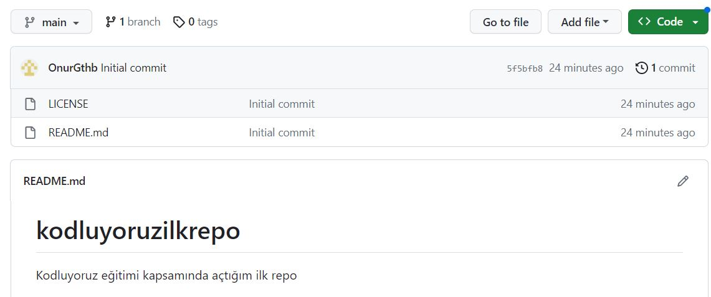

# kodluyoruzilkrepo

Kodluyoruz eğitimi kapsamında açtığım ilk repo, içerisinde 1 adet README dosyası, 1 adet de index.html barındırıyor.

# Installation

Öncelikle projeyi clonelayın. (https://github.com/OnurGthb/kodluyoruzilkrepo.git)

`git clone https://github.com/OnurGthb/kodluyoruzilkrepo.git`

# Usage

Projeyi cloneladıktan sonra Visual Studio Code programında açınız.

Linux için:

`cd kodluyoruzilkrepo `

`code .`

# Contributing

Pull requestler kabul edilir. Büyük değişiklikler için, lütfen önce neyi değiştirmek istediğinizi tartışmak için bir konu açınız.

# License

[MIT](https://choosealicense.com/licenses/mit/ "Link")

# Photo

